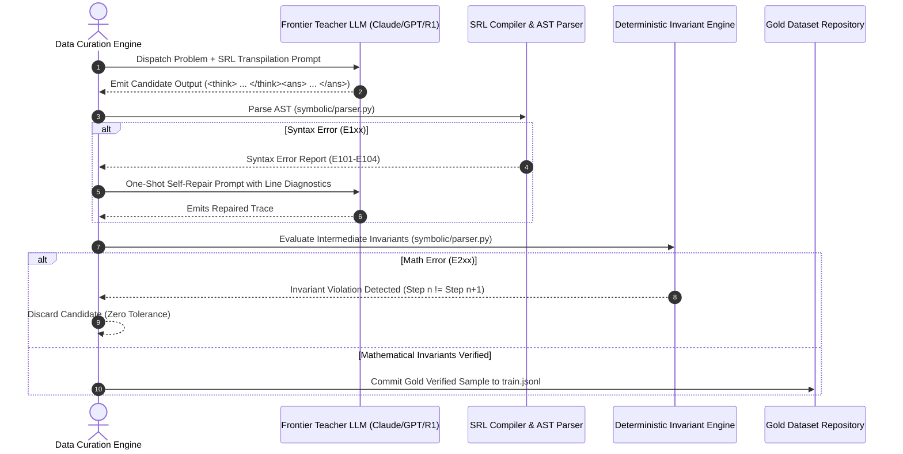

# SymboLM Dataset Curation & Frontier AI Distillation Strategy

**Author:** Sanish Gyawali  
**Version:** 1.0.0 (Research & Production Strategy)  
**Project:** SymboLM (Adaptive Symbolic Reasoning & Token-Compressed Intelligence)  
**Repository:** [https://github.com/gyawalisanish0/symboLM](https://github.com/gyawalisanish0/symboLM)

---

## 1. Executive Summary & Theoretical Rationale

Large Language Models (LLMs) trained with conventional Chain-of-Thought (CoT) waste significant sequence length generating natural language connective tissue (*"Let's break this down step by step", "First, we need to consider...", "Now let's calculate..."*). While this conversational verbosity provides compute steps for auto-regressive attention, it introduces three severe failure modes:
1. **Inference Latency & KV-Cache Bloat:** 600–1,200 tokens per reasoning path exhausts memory bandwidth and limits serving concurrency.
2. **Linguistic Drift & Hallucination:** Informal prose allows intermediate mathematical errors to hide behind persuasive rhetorical filler.
3. **Prohibitive Test-Time Search Cost:** Best-of-$N$ consensus sampling is economically infeasible when each candidate trajectory generates hundreds of redundant English tokens.

**SymboLM resolves this by transmuting Chain-of-Thought into the SymboLM Reasoning Language (SRL v1.0)**—a formally parsed, compiler-verifiable domain-specific language.

To scale SymboLM from our initial 1.5B prototype to future frontier-challenging models (such as **Microsoft Phi-4-mini**, **Google Gemma 2/3**, and open-source GPT architectures), we require an automated, high-throughput **Synthetic Data Curation & Distillation Engine**. This document establishes the blueprint for extracting reasoning capabilities from frontier models (Claude 3.5 Sonnet, GPT-4o, DeepSeek-R1, and QwQ-32B), translating them into canonical SRL v1.0, and validating them through compiler-grade AST and SymPy invariants.

---

## 2. The Multi-Register Dataset Taxonomy (60 / 20 / 20 Rule)

To prevent cognitive degeneration ("reasoning lobotomy"), the training distribution must maintain a strict multi-register balance:

```
┌────────────────────────────────────────────────────────────────────────┐
│                   SymboLM Balanced Training Corpus                     │
├────────────────────────────┬─────────────────────────────┬─────────────┤
│ Register 1: Symbolic Logic │ Register 2: Factual Bypass  │ Register 3: │
│       (60% of Corpus)      │       (20% of Corpus)       │ Intent Prep │
│                            │                             │ (20% Corpus)│
└────────────────────────────┴─────────────────────────────┴─────────────┘
```

### 2.1. Register 1: Deductive Symbolic Reasoning (60%)
- **Target Domains:** Arithmetic, Elementary Algebra, Combinatorics, Geometry, Formal Logic (Syllogisms, Boolean algebra), and Algorithmic trace evaluation.
- **Data Format:**
  ```text
  <think>
  let(x = initial_value) | transform(x) → y | verify(condition) ✓ | ∴ answer
  </think>
  <ans>answer</ans>
  ```
- **Source Benchmarks:** GSM8K, MATH (Levels 1–5), OlympiadBench, SVAMP, ASDiv, LogiQA, AMC 10/12.

### 2.2. Register 2: Zero-Shot Factual Bypass (20%)
- **Target Domains:** Direct factual retrieval, encyclopedic knowledge, syntax lookups, and deterministic lookup queries.
- **Behavioral Objective:** Suppress unnecessary thinking tokens entirely. An intelligent model must know when *not* to overthink.
- **Data Format:**
  ```text
  <think></think>
  <ans>Direct factual answer</ans>
  ```
  *(or omit `<think>` tags completely)*
- **Source Benchmarks:** MMLU (Humanities, Social Sciences), TriviaQA, Natural Questions, PopQA.

### 2.3. Register 3: Intent Scratchpads & Conversational Planning (20%)
- **Target Domains:** Interpersonal dialogue, strategic negotiations, psychological safety, multi-turn task planning.
- **Behavioral Objective:** Plan tone, emotional intent, and strategic response in a compact 10-token scratchpad before generating fluent, warm natural language for the user.
- **Data Format:**
  ```text
  <think>
  intent: validate_frustration | strategy: acknowledge_issue + offer_patch | tone: empathetic
  </think>
  I completely understand how frustrating it is when a runtime restart interrupts your training pipeline. Let's inspect the checkpoint together and resume seamlessly.
  ```
- **Source Benchmarks:** LMSYS Chatbot Arena, MT-Bench, UltraFeedback, Anthropic HH-RLHF.

---

## 3. Frontier AI Teacher Distillation Architecture

Frontier closed-source and open-weights reasoning models possess massive latent deductive capabilities. We extract this knowledge using two distinct distillation pathways: **Direct SRL Synthesis** and **CoT Deconstruction & Transpilation**.

```
                       ┌────────────────────────────────────────┐
                       │  Frontier Teacher Models               │
                       │  - DeepSeek-R1 (671B MoE)              │
                       │  - Anthropic Claude 3.5 Sonnet         │
                       │  - OpenAI o1 / o3-mini / GPT-4o        │
                       │  - QwQ-32B                             │
                       └───────────────────┬────────────────────┘
                                           │
                     ┌─────────────────────┴─────────────────────┐
                     ▼                                           ▼
          [Pathway A: Direct Synthesis]            [Pathway B: CoT Transpilation]
          Generates native SRL v1.0 traces          Compresses verbose English CoT
          from unsolved problems                    into dense canonical SRL AST
                     │                                           │
                     └─────────────────────┬─────────────────────┘
                                           ▼
                       ┌────────────────────────────────────────┐
                       │  Automated Compiler Quality Gate       │
                       │  1. Lexer & EBNF AST Parser (E1xx)     │
                       │  2. SymPy Intermediate Evaluator (E2xx)│
                       │  3. Ground-Truth Match (E3xx)          │
                       │  4. English Leakage & Compression Audit│
                       └───────────────────┬────────────────────┘
                                           │
                      ┌────────────────────┴────────────────────┐
                      ▼                                         ▼
                 [Rejected]                                [Accepted]
           Rejection log / Self-repair               Added to Gold Training Pool
```

### 3.1. Pathway A: Direct SRL Synthesis Prompt Template
Used with frontier teacher models to generate pure symbolic traces directly from raw problem statements:

```markdown
You are an expert compiler and symbolic reasoning teacher for SymboLM.
Your task is to solve the given problem using ONLY the SymboLM Reasoning Language (SRL v1.0).

STRICT GRAMMAR RULES:
1. Enclose your reasoning entirely within <think> and </think>.
2. Do NOT output any conversational English inside <think>. Every step must be formal syntax.
3. Steps must be separated by the pipe character '|' or newline.
4. Use atomic operators:
   - Declarations: let(variable = value) or hyp(condition)
   - Transformations: expression → target_expression
   - Invariants & Checks: verify(boolean_condition) ✓
   - State Tracking: state(var1=val1, var2=val2)
   - Conclusions: ∴ final_expression
5. Terminate with <ans>final_answer</ans>.
6. Every mathematical transition must be mathematically sound. 
   Do NOT skip arithmetic steps that cannot be verified by SymPy.

PROBLEM:
{problem}

SRL v1.0 REASONING TRACE:
```

### 3.2. Pathway B: CoT Deconstruction & Transpilation Template
Used to convert massive existing open CoT datasets (e.g. Open-R1, NuminaMath, Dolphin-R1) into clean SRL:

```markdown
You are an algorithmic transpiler converting verbose English Chain-of-Thought into SymboLM Reasoning Language (SRL v1.0).

INPUT ENGLISH CHAIN-OF-THOUGHT:
"{english_cot}"

GROUND TRUTH ANSWER:
"{ground_truth_answer}"

TRANSPILATION OBJECTIVES:
1. Strip all conversational pleasantries, rhetorical questions, and stream-of-consciousness meta-commentary.
2. Extract the core mathematical declarations, algebraic reductions, and conditional branch evaluations.
3. Express the solution strictly in SRL v1.0 syntax:
   - Use '→' for algebraic simplifications.
   - Use 'verify(...)' to confirm intermediate constraints.
   - Use '∴' for the final deduced value.
4. Ensure the final extracted value EXACTLY matches the ground truth answer: "{ground_truth_answer}".
5. Target compression: The symbolic trace must use at least 60% fewer tokens than the English original.

OUTPUT FORMAT:
<think>
[SRL Trace]
</think>
<ans>{ground_truth_answer}</ans>
```

---

## 4. Compiler-Grade Verification & Filtering Pipeline

A primary failure of conventional synthetic datasets is "silent hallucination"—subtle errors in teacher reasoning that corrupt fine-tuning. SymboLM eliminates this by running every candidate sample through our deterministic verification engine:

```python
# Verification Cascade: Zero Tolerance for Syntax or Math Hallucinations
candidate_sample -> Lexical & EBNF Check -> SymPy Invariant Check -> Answer Matching -> Leak Audit
```

### 4.1. Level 1: Lexical & EBNF Grammar Verification (`symbolic/parser.py`)
Every trace is parsed into a strongly-typed Abstract Syntax Tree (`TraceNode`).
- **Diagnostic `E101` (Unrecognized Token):** Flags non-canonical characters or unescaped linguistic symbols.
- **Diagnostic `E102` (Unbalanced Delimiters):** Flags mismatched parentheses `()`, brackets `[]`, or tags.
- **Diagnostic `E103` (Malformed Expression):** Flags syntax that fails EBNF production rules.
- **Action:** Traces with any `E1xx` error are immediately dropped.

### 4.2. Level 2: Intermediate SymPy Invariant Evaluation (`evaluate_invariants`)
For every transformation step `expr_a → expr_b`, our SymPy evaluator executes an algebraic invariant check:
$$\text{Simplify}(\text{expr}_a - \text{expr}_b) \stackrel{?}{=} 0$$
- **Diagnostic `E201` (Arithmetic Mutation Inconsistency):** e.g., $14 \times 3 \rightarrow 52$ (Evaluates to $-10 \neq 0$).
- **Diagnostic `E202` (Equation Solution Set Invariance Broken):** The solution set to the transformed equation differs from the prior state.
- **Diagnostic `E203` (Contradictory Verification Flag):** e.g., `verify(5 > 10) ✓` (Condition is false, but flagged true).
- **Action:** Any arithmetic violation results in instant sample disqualification.

### 4.3. Level 3: Ground-Truth Answer Equivalence (`data/verify_answers.py`)
The terminal value deduced at `∴ value` must match the benchmark ground truth:
- Numeric equivalence: $|V_{\text{extracted}} - V_{\text{truth}}| < 10^{-5}$
- Symbolic equivalence: $\text{SymPy.simplify}(V_{\text{extracted}} - V_{\text{truth}}) == 0$
- String/Categorical equivalence: Canonical normalized match for multiple choice or Boolean answers.

### 4.4. Level 4: English Leakage & Compression Audit
- **English Leak Score ($L$):** Measures the proportion of alphabetical words with length $> 3$ inside `<think>` that do not match recognized mathematical identifiers or state variables. Must satisfy:
  $$L_{\text{leak}} \le 0.15$$
- **Token Compression Ratio ($C$):**
  $$C = 1 - \frac{\text{Tokens}(\text{Symbolic Trace})}{\text{Tokens}(\text{English CoT})} \ge 0.50$$
  Traces failing to achieve at least 50% token reduction are flagged for re-compression.

---

## 5. Multi-Agent Synthetic Data Flywheel

To automate this pipeline at scale, we establish an asynchronous Multi-Agent Teacher-Verifier loop:



### Self-Repair Feedback Loop
When a candidate trace fails with an `E1xx` (syntax error) or minor formatting discrepancy, the engine initiates a 1-turn automated repair prompt:
```text
Your previous output failed the SymboLM compiler validation with the following diagnostic:
ERROR CODE: {error_code}
LOCATION: Line {line}, Column {col}
DETAILS: {error_details}
ORIGINAL TRACE:
{faulty_trace}

Fix the syntax violation while preserving the mathematical steps. Output ONLY the corrected <think>...</think><ans>...</ans>.
```
If the repaired trace does not pass on the second attempt, it is discarded. This guarantees that **100% of the fine-tuning corpus is syntactically and mathematically immaculate**.

---

## 6. Target Dataset Scale & Expansion Milestones

| Milestone | Target Samples | Source Mix | Target Hardware | Purpose |
| :--- | :--- | :--- | :--- | :--- |
| **Stage 1 (Current)** | **5,200** | 3,600 GSM8K + 400 Val + 1,200 Test | Google Colab TPU v5e (16GB) | Syntax grounding, token alignment, loss convergence. |
| **Stage 2 (Expansion)** | **25,000** | GSM8K (8k) + MATH L1-3 (7k) + Factual QA (5k) + Chat Intent (5k) | Multi-TPU / A100 80GB | Eliminate English drift; establish multi-register robustness. |
| **Stage 3 (Frontier)** | **100,000+** | OlympiadBench (10k) + MATH L4-5 (15k) + NuminaMath (35k) + Complex QA (20k) + Strategic Intent (20k) | TPU v5p / H100 Cluster | Full competitive performance against frontier models. |

---

## 7. Future Model Transfer Strategy

The symbolic reasoning representation developed in SymboLM is **model-agnostic**. The same dataset and compiler pipeline can be transferred to next-generation open-weights base architectures:

### 7.1. Microsoft Phi-4-mini (3.8B)
- **Strengths:** Exceptional pre-trained synthetic textbook reasoning; compact parameter footprint.
- **Adaptation Plan:** Extend the Phi-4 tokenizer with SRL symbols, initialize embeddings via semantic warm-start (`initialize_symbol_embeddings`), and execute LoRA on all projection matrices (`q_proj`, `k_proj`, `v_proj`, `o_proj`, `gate_proj`, `up_proj`, `down_proj`).

### 7.2. Google Gemma 2 / Gemma 3 (2B & 9B)
- **Strengths:** Leading architectural efficiency, sliding-window local attention, massive knowledge recall.
- **Adaptation Plan:** Native bfloat16 training on Google Cloud TPU v5e/v5p pods using JAX/Flax or PyTorch/XLA.

### 7.3. GPT-OSS / Open-Source Frontier Architectures
- **Strengths:** Maximum community accessibility on Hugging Face.
- **Open-Source Delivery:** All curated symbolic datasets will be published to Hugging Face under `gyawalisanish0/symbolm-reasoning-corpus-v1` with complete data cards, AST verification certificates, and reproducibility scripts.

---

## 8. Summary Checklist for Curation Execution

- [x] Canonical EBNF grammar defined (`symbolic/SPECIFICATION.md`).
- [x] AST parser & SymPy invariant checker built & unit-tested (`tests/test_parser.py`).
- [x] Initial GSM8K dataset builder implemented (`data/build_dataset.py`).
- [x] Frontier AI distillation prompts designed (Pathways A & B).
- [ ] Automate multi-agent batch distillation script (`data/distill_frontier.py`).
- [ ] Incorporate MATH Parquet format for Level 1–5 problems.
- [ ] Publish verified dataset corpus to Hugging Face Hub under Sanish Gyawali's profile.
